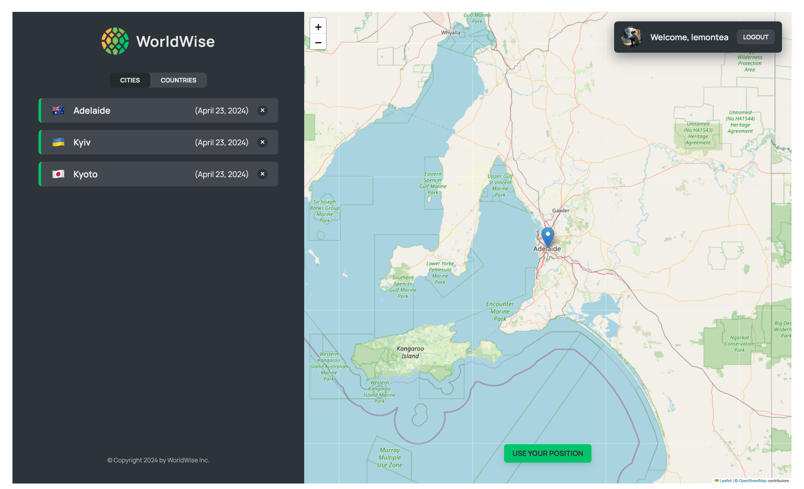

# WorldWise

WorldWise is a single page application that allows users to record and keep track of the cities they have traveled to. It provides a user-friendly interface for adding, viewing, and managing travel memories.



## Features

- Interactive map: Click on any location on the map to add a new city entry.
- City list: View a list of all the cities you have traveled to.
- City details: Click on a city from the list to view more details about your trip.
- Add travel memories: Fill out a form to add a new city entry, including the city name, travel date, and notes about your trip.
- Geolocation: Use your current position to set the map location.
- Country list: View a list of all the countries you have visited.

## Technologies Used

- Vite: A fast build tool and development server for modern web applications.
- React Router: A routing library for handling navigation in a React application.
- Leaflet: An open-source JavaScript library for interactive maps.
- React Datepicker: A reusable datepicker component for React.
- CSS Modules: A CSS file in which all class names and animation names are scoped locally by default.
- Context API: A React API for managing global state and sharing data across components.
- Fetch API: A modern JavaScript API for making HTTP requests.
- json-server: A tool for quickly setting up a fake REST API from a JSON file.

## Getting Started

1. Clone the repository:

```
git clone https://github.com/lemonteaau/World-Wise.git
```

2. Install the dependencies:

```
cd World-Wise
npm install
```

3. Start the json-server:

```
npm run server
```

This will start the json-server and watch the data/cities.json file for changes. The server will run on http://localhost:8000. The json-server provides a fake REST API based on the data in the data/cities.json file.

4. Start the development server:

```
npm run dev
```

5. Open the app in your browser at `http://localhost:5173`.

## Contributing

Contributions are welcome! If you find any bugs or have suggestions for improvements, please open an issue or submit a pull request.

## License

This project is licensed under the [MIT License](LICENSE).
